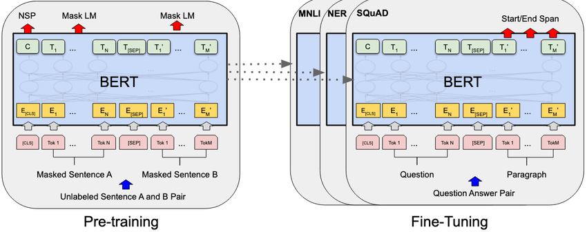

# A. Giới thiệu
## A.1. Khó khăn và Nhu cầu Tối ưu Hệ thống Hỗ trợ Sinh viên
Hiện nay, tại các trường đại học, dịch vụ hỗ trợ sinh viên đóng vai trò quan trọng trong việc xử lý các thắc mắc và đáp ứng yêu cầu về hành chính, học thuật cũng như các vấn đề cá nhân của sinh viên. Những dịch vụ này là cầu nối giữa sinh viên và nhà trường, hỗ trợ đăng ký môn học, thông tin học bổng, học phí, thông tin tốt nghiệp, điều chỉnh khóa học và nhiều yêu cầu khác.

Hệ thống hỗ trợ hoạt động như một kênh trò chuyện giữa sinh viên và đội ngũ hỗ trợ. Khi sinh viên cần hỗ trợ, họ sẽ tạo câu hỏi hoặc yêu cầu và gửi đến hệ thống. Hệ thống sau đó chuyển câu hỏi đến người phụ trách có chuyên môn phù hợp. Sau khi tiếp nhận, chuyên viên sẽ phản hồi một cách chính xác để giải quyết vấn đề của sinh viên và gửi lại qua hệ thống. Quy trình này được minh họa trong sơ đồ Hình 1.

<sơ đồ - Hình 1>

Tại hệ thống BKSI - kênh hỗ trợ sinh viên của Trường Đại học Bách Khoa, Đại học Quốc gia TP.HCM, sinh viên có thể đặt câu hỏi bằng cách chọn loại yêu cầu, nhập chủ đề và nội dung, sau đó gửi đi (Hình 2).

<Giao diện - hình 2>

Những yêu cầu của sinh viên sẽ được xử lý bởi các cán bộ phụ trách trong trường. Giao diện cho cán bộ trả lời sinh viên được mô tả ở Hình 3. Khi sinh viên gửi yêu cầu, hệ thống tạo một “ticket” – luồng thông tin cho phép hai bên trao đổi. Nếu sinh viên có thêm thắc mắc hoặc chưa hài lòng với câu trả lời, họ có thể tiếp tục phản hồi trong ticket này.

Cán bộ hỗ trợ cần đọc hiểu kỹ câu hỏi từ sinh viên và có kiến thức sâu về quy định cũng như các nghiệp vụ của trường để trả lời chính xác. Hình 4 là giao diện của cán bộ khi trả lời câu hỏi của sinh viên.

<Hình 3, giao diện tiếp nhận câu hỏi> <Hình 4, cán bộ nhập nội dung trả lời>

Việc nhớ hết các quy định và nghiệp vụ của nhà trường là không dễ dàng. Các chuyên viên có thể cần phải tra cứu lại tài liệu để đảm bảo câu trả lời chính xác, tiêu tốn không ít thời gian và công sức. Hơn nữa, các câu hỏi dài, lan man có thể khiến chuyên viên khó hiểu rõ ý định của sinh viên, gây lãng phí thời gian (Hình 5). Việc xác định rõ ý định và thông tin cần thiết giúp cán bộ trả lời nhanh và hiệu quả hơn.

<Hình 5 - câu hỏi dài của sinh viên>

Với số lượng yêu cầu lớn, việc phản hồi kịp thời là thách thức cho các trường đại học. Nhiều trường đang dần chuyển dịch vụ hỗ trợ từ con người sang hệ thống máy tính thông minh như trợ lý ảo hay chatbot. Nền tảng của hệ thống này là đồ thị tri thức, giúp quản lý kiến thức về nghiệp vụ và nhận diện ý định của sinh viên để hỗ trợ hiệu quả hơn.
## A.2. Vai trò của Trợ lý Ảo và Đồ thị Tri thức trong Nâng cao Hiệu quả Hỗ trợ Sinh viên
Trong bối cảnh hiện đại, trợ lý ảo đang trở nên phổ biến và ngày càng đóng vai trò quan trọng, do đó việc nâng cao hiệu quả của chúng là điều cần thiết. Một trong những yếu tố quyết định sự thành công của các trợ lý ảo chính là khả năng hiểu và đáp ứng đúng yêu cầu của người dùng. Trong xử lý ngôn ngữ, yêu cầu của người dùng có thể được tóm tắt dưới dạng “khung ngữ nghĩa” (semantic frame), bao gồm ý định và các thông tin cần thiết khác. Trong hệ thống hỗ trợ sinh viên, việc nhận diện ý định của người dùng không chỉ quan trọng cho tự động hóa mà còn giúp cán bộ xử lý câu hỏi dễ dàng. Thay vì đọc toàn bộ câu hỏi dài, cán bộ chỉ cần xem thông tin tóm lược trong khung ngữ nghĩa để hiểu vấn đề và phản hồi nhanh chóng.

Một thách thức khác của hệ thống hỗ trợ sinh viên là tạo ra nền tảng vừa lưu trữ, vừa dễ dàng tìm kiếm thông tin. Đồ thị tri thức hiện nay là công nghệ phù hợp để giải quyết nhu cầu này, lấy ý tưởng từ Semantic Web là "tổ chức" và "gắn kết" dữ liệu trên web một cách có ý nghĩa hơn, dựa trên các tiêu chuẩn và định dạng chung, để máy tính có thể “hiểu” và liên kết các dữ liệu này lại với nhau. Trong giáo dục, đồ thị tri thức có thể tích hợp thông tin từ các cơ sở dữ liệu khác nhau như hồ sơ sinh viên, khóa học, quy định trường học vào một định dạng chung. Các chatbot và hệ thống hỏi đáp đang sử dụng đồ thị tri thức phổ biến, vì nó giúp truy xuất thông tin chính xác hơn, giảm thiểu tình trạng tạo ra các thông tin sai lệch ở các mô hình ngôn ngữ lớn (LLM).

Trong hệ thống hỗ trợ sinh viên, đồ thị tri thức không chỉ chứa kiến thức nghiệp vụ và quy định của trường mà còn lưu trữ thông tin về ý định của sinh viên. Điều này giúp hệ thống suy luận và phản hồi hiệu quả hơn. Ví dụ, khi sinh viên muốn đăng ký luận văn tốt nghiệp, hệ thống có thể sử dụng dữ liệu có trong đồ thị tri thức như điểm anh văn và quy chế trường để xem sinh viên có đủ điều kiện đăng ký hay không, và đưa ra phản hồi thích hợp.

Việc tích hợp khung ngữ nghĩa (gồm ý định và các thông tin liên quan) vào đồ thị tri thức giúp hệ thống hoạt động tối ưu hơn. Một bài nghiên cứu trước đây tại HCMUT đã đề xuất cấu trúc đồ thị tri thức tích hợp ý định dưới dạng các thực thể và các mối quan hệ liên quan. Tiếp nối ý tưởng này, nhóm chúng tôi xây dựng đồ thị tri thức xem các ý định là mối quan hệ giữa các thực thể trong trường. Hình 6 minh họa cấu trúc của đồ thị tri thức này, trong đó các khối hình chữ nhật cạnh tròn biểu thị ý định, khối hình bình hành biểu thị các quy định, và các khối oval biểu thị các thực thể khác trong hệ thống.

<Hình 6: Đồ thị tri thức bao gồm ý định trong lĩnh vực giáo dục [4]>

Xây dựng đồ thị tri thức là quá trình quan trọng để tổ chức thông tin và nắm bắt các mối liên hệ giữa các thực thể trong một lĩnh vực cụ thể. Trong đó, nhiệm vụ khám phá và rút trích quan hệ đóng vai trò cốt lõi, giúp tạo nên cấu trúc kết nối logic giữa các thực thể, từ đó nâng cao khả năng truy xuất và sử dụng thông tin.

Khám phá và rút trích quan hệ từ dữ liệu thô không chỉ đòi hỏi khả năng xác định đúng các thực thể mà còn cần xác định chính xác bản chất của mối quan hệ giữa chúng. Các mối quan hệ này có thể là các liên kết trực tiếp (như giữa sinh viên và khóa học đã đăng ký) hoặc các mối quan hệ phức tạp hơn, liên quan đến quy định, quy chế và điều kiện cụ thể. Quá trình rút trích quan hệ chính xác giúp hệ thống có thể suy luận và cung cấp thông tin phù hợp dựa trên bối cảnh, giảm thiểu thời gian xử lý và nâng cao độ chính xác trong phản hồi.

Phương pháp rút trích quan hệ hiện đại sử dụng các kỹ thuật xử lý ngôn ngữ tự nhiên và học máy để phát hiện ra các kiểu quan hệ tiềm năng giữa các thực thể, sau đó tích hợp các quan hệ này vào cấu trúc đồ thị tri thức. Các hệ thống này có khả năng học và mở rộng dựa trên dữ liệu đầu vào mới, giúp đồ thị tri thức liên tục phát triển và phản ánh chính xác mối quan hệ thực tế.
## A.3. Mục tiêu nghiên cứu
Dựa trên vấn đề đã trình bày, nhóm nghiên cứu đặt ra hai mục tiêu chính:
- Xây dựng một framework nhằm khám phá các mối quan hệ mới từ các tập thực thể và mối quan hệ đã biết.
- Đề xuất phương pháp cho nhiệm vụ "khám phá quan hệ".
## A.4 Phạm vi đề tài
## A.5 Cấu trúc Bài viết
Nội dung còn lại của báo cáo sẽ được trình bày theo cấu trúc dưới đây:

### Chương 2: Cơ sở lý thuyết
Chương này sẽ trình bày các khái niệm lý thuyết nền tảng mà nhóm nghiên cứu áp dụng cho đề tài. Nội dung bao gồm các kiến thức liên quan đến Đồ thị tri thức (KG), Đọc hiểu máy (MRC), Attention, cùng với nhiều vấn đề khác trong lĩnh vực Học máy (ML) và Xử lý ngôn ngữ tự nhiên (NLP). Các kiến trúc mô hình sử dụng cũng sẽ được giới thiệu trong chương này.

### Chương 3: Các công trình liên quan
Chương này cung cấp cái nhìn tổng quan về các nghiên cứu trước đây liên quan đến các nhiệm vụ trong đề tài, bao gồm Xây dựng đồ thị tri thức (KG), Đọc hiểu máy (MRC), Mô hình ngôn ngữ (LM). Nhóm sẽ tập trung vào những nghiên cứu trong lĩnh vực giáo dục và ngôn ngữ Việt, từ đó đề xuất phương pháp và mô hình dựa trên các nghiên cứu này.

### Chương 4: Phương pháp
Chương này sẽ mô tả chi tiết về framework mà nhóm đã phát triển, cũng như phương pháp nghiên cứu, bao gồm tổng thể quy trình và từng bước xử lý cụ thể.

### Chương 5: Thí nghiệm
Trong chương này, nhóm sẽ trình bày các thông tin chi tiết về dữ liệu được sử dụng, cách thức thiết lập thí nghiệm, và kết quả đánh giá các thí nghiệm này. Bên cạnh đó, nhóm cũng sẽ tiến hành phân tích và đánh giá các kết quả thu được.

### Chương 6: Tổng kết
Chương này sẽ tóm tắt các kết quả đạt được của nhóm so với mục tiêu ban đầu, bao gồm những thành tựu đã hoàn thành và những điểm cần cải thiện. Đồng thời, bảng phân chia khối lượng công việc của các thành viên trong nhóm cũng sẽ được công bố trong chương này.
# B. Cơ sở lý thuyết
## B.1. Cơ chế Attention (“Attention is All You Need”)
Cơ chế Attention (Sự chú ý) là một khái niệm quan trọng trong lĩnh vực học sâu, đặc biệt trong các mô hình xử lý ngôn ngữ tự nhiên và thị giác máy. Dưới đây là giải thích chi tiết về cách hoạt động của cơ chế Attention:
### 1. Khái niệm chung
Cơ chế Attention cho phép mô hình tập trung vào những phần quan trọng của dữ liệu đầu vào trong quá trình xử lý thông tin. Thay vì xem tất cả các đầu vào là ngang bằng nhau, Attention giúp xác định những phần nào là quan trọng nhất để đưa ra dự đoán chính xác hơn.

### 2. Cấu trúc cơ bản
Cơ chế Attention thường bao gồm ba thành phần chính:
- Query (Q): Là đầu vào mà mô hình muốn tìm kiếm thông tin tương ứng từ các đầu vào khác.
- Key (K): Là các đầu vào (thường là các phần tử trong chuỗi đầu vào) mà mô hình sẽ so sánh với Query để xác định mức độ liên quan.
- Value (V): Là thông tin mà mô hình sẽ thu thập dựa trên sự so sánh giữa Query và Key.
### 3. Quy trình hoạt động
Quy trình hoạt động của Attention thường được mô tả qua các bước sau:

- Tính toán độ tương đồng: Đầu tiên, mô hình tính toán độ tương đồng giữa Query và mỗi Key. Thông thường, điều này được thực hiện thông qua phép nhân dot product hoặc cosine similarity.

- Áp dụng hàm softmax: Sau khi tính toán độ tương đồng, mô hình áp dụng hàm softmax lên các giá trị độ tương đồng để biến chúng thành các xác suất, cho phép mô hình xác định mức độ quan trọng của từng Key.

- Kết hợp các giá trị: Cuối cùng, các xác suất này được sử dụng để tính toán một trọng số cho các Value tương ứng. Mô hình kết hợp các Value dựa trên trọng số này để tạo ra đầu ra cuối cùng.

### 4. Tính toán Attention
Công thức tính Attention có thể được biểu diễn như sau:

Trong đó:
- 𝑄: Q là ma trận Query.
- 𝐾: K là ma trận Key.
- 𝑉: V là ma trận Value.
- 𝑑𝑘 là kích thước của Key, được sử dụng để điều chỉnh độ lớn của giá trị dot product.

### 6. Ứng dụng
Cơ chế Attention đã được áp dụng rộng rãi trong các mô hình như Transformers, BERT, và nhiều mô hình học sâu khác trong lĩnh vực xử lý ngôn ngữ tự nhiên và thị giác máy, giúp cải thiện đáng kể độ chính xác và hiệu suất của các mô hình này.
Cơ chế Attention là một trong những phát minh quan trọng nhất trong học sâu, giúp các mô hình trở nên mạnh mẽ hơn trong việc xử lý và hiểu thông tin phức tạp. Nhờ có Attention, mô hình có khả năng tập trung vào những phần quan trọng nhất của dữ liệu, từ đó cải thiện hiệu suất và độ chính xác trong các nhiệm vụ khác nhau.

Nguồn tham khảo: https://arxiv.org/pdf/1706.03762
## B.2. Mô hình transformers
## B.3. Pre-trained language model (Các mô hình ngôn ngữ huấn luyện trước)
Các mô hình huấn luyện trước là các mạng nơ-ron hoặc mô hình máy học đã được đào tạo trên một tập dữ liệu lớn, thường đòi hỏi nhiều tài nguyên tính toán và thời gian. Những mô hình này có thể được tinh chỉnh hoặc áp dụng trực tiếp cho các nhiệm vụ cụ thể, nhờ vào việc khai thác các đặc điểm và mẫu đã học từ tập dữ liệu ban đầu. Mô hình huấn luyện trước đặc biệt có giá trị trong các trường hợp mà việc đào tạo mô hình từ đầu không khả thi do hạn chế về dữ liệu, tài nguyên tính toán hoặc thời gian.

Một số mô hình huấn luyện trước nổi bật hiện nay như BERT [12], GPT [52], và RoBERTa [30] đóng vai trò quan trọng trong lĩnh vực xử lý ngôn ngữ tự nhiên, nhờ vào khả năng nắm bắt và hiểu ngữ cảnh của văn bản một cách hiệu quả.

Bên dưới là một số mô hình phổ biến hiện nay.

### Mô hình BERT
BERT (Bidirectional Encoder Representations from Transformers) là một mô hình học sâu được xây dựng trên kiến trúc Transformers, do nhóm nghiên cứu Google AI Language phát triển. Mô hình này hoạt động như một công cụ đa năng cho hơn 11 tác vụ ngôn ngữ phổ biến.

Trước đây, các mô hình ngôn ngữ chỉ có thể xử lý văn bản đầu vào theo thứ tự tuần tự từ trái sang phải (left-to-right) hoặc từ phải sang trái (right-to-left), mà không thể thực hiện đồng thời cả hai hướng. Điểm khác biệt của BERT là khả năng đọc văn bản từ cả hai phía cùng lúc, nhờ vào thiết kế cho phép tính hai chiều. Sự phát triển của các mô hình Transformers đã làm cho khả năng này trở thành hiện thực. BERT sử dụng bộ mã hóa Transformers để học các biểu diễn từ (text representations) từ một tập dữ liệu không được gán nhãn.

Kiến trúc của BERT bao gồm hai giai đoạn: huấn luyện trước (pre-training) và tinh chỉnh (fine-tuning).

Trong giai đoạn huấn luyện trước (pre-training), mô hình thực hiện hai nhiệm vụ chính:

- Masked Language Modeling (MLM): Trong nhiệm vụ này, một phần dữ liệu sẽ bị che giấu và một tỷ lệ nhất định các từ trong câu sẽ được thay thế bằng mặt nạ [mask]. Mô hình phải dự đoán các từ gốc tại những vị trí bị che giấu, dựa vào ngữ cảnh của các từ xung quanh.

- Next Sentence Prediction (NSP): Đây là nhiệm vụ mà BERT được huấn luyện để xác định xem một câu có phải là câu tiếp theo của câu trước đó trong văn bản gốc hay không. Nhiệm vụ này giúp mô hình nắm bắt mối quan hệ giữa các câu.

Để thực hiện tinh chỉnh (fine-tuning), mô hình BERT sẽ được khởi tạo với các tham số đã được huấn luyện trước, sau đó tất cả các tham số này sẽ được điều chỉnh thông qua việc sử dụng dữ liệu có gán nhãn từ các tác vụ xuôi dòng (downstream tasks). Mỗi tác vụ xuôi dòng có các mô hình tinh chỉnh riêng, mặc dù tất cả đều được khởi tạo từ cùng một tập tham số đã huấn luyện trước. Trong quá trình này, các tham số của mô hình sẽ được điều chỉnh thông qua việc huấn luyện có giám sát trên dữ liệu đã được gán nhãn cụ thể cho nhiệm vụ đó.

### Mô hình GPT-2 (Generative Pretrained Transformer 2)
Mô hình GPT-2 (Generative Pretrained Transformer 2) là một trong những mô hình ngôn ngữ tiên tiến được phát triển bởi OpenAI. Ra mắt vào năm 2019, GPT-2 là phiên bản cải tiến của mô hình GPT đầu tiên, với khả năng sinh ra văn bản tự nhiên một cách mượt mà và tự nhiên hơn. Mô hình này dựa trên kiến trúc Transformer, cho phép nó xử lý và tạo ra văn bản dựa trên bối cảnh trước đó mà không cần thiết phải có dữ liệu đầu vào cụ thể.

GPT-2 đã được huấn luyện trên một tập dữ liệu khổng lồ từ Internet, giúp nó có khả năng hiểu ngữ nghĩa, ngữ pháp, và phong cách viết của con người. Với 1,5 tỷ tham số, GPT-2 có khả năng tạo ra văn bản có độ dài khác nhau và thực hiện nhiều tác vụ khác nhau, từ viết bài báo, tóm tắt văn bản, cho đến tạo ra các câu chuyện hư cấu.

Mô hình GPT-2 hoạt động dựa trên các nguyên lý chính sau:

- Kiến trúc Transformer: GPT-2 sử dụng kiến trúc Transformer, bao gồm các thành phần chính như Multi-Head Attention và Feedforward Neural Network. Kiến trúc này cho phép mô hình xử lý các mối quan hệ trong dữ liệu đầu vào một cách hiệu quả, tập trung vào các phần quan trọng của văn bản mà không phụ thuộc vào thứ tự từ ngữ.

- Pretraining và Fine-tuning:
    - Pretraining: GPT-2 được huấn luyện trên một lượng lớn dữ liệu chưa được gán nhãn (unsupervised data). Mô hình học cách dự đoán từ tiếp theo trong một câu, dựa trên các từ trước đó. Quá trình này giúp nó nắm bắt các đặc điểm ngữ nghĩa và ngữ pháp của ngôn ngữ.
    - Fine-tuning: Sau khi pretraining, mô hình có thể được tinh chỉnh (fine-tuned) trên các tác vụ cụ thể với dữ liệu gán nhãn để cải thiện hiệu suất.
- Cơ chế Attention: Cơ chế Attention cho phép mô hình chú ý đến các từ hoặc cụm từ khác nhau trong văn bản, giúp xác định tầm quan trọng của chúng trong ngữ cảnh. Điều này cho phép GPT-2 tạo ra các câu có tính liên kết cao và phù hợp hơn.

- Sinh văn bản tự động: Khi nhận đầu vào là một chuỗi từ, GPT-2 sẽ sinh ra từ tiếp theo bằng cách dự đoán xác suất của tất cả các từ trong từ điển và chọn từ có xác suất cao nhất. Quá trình này lặp lại cho đến khi mô hình tạo ra một đoạn văn bản hoàn chỉnh.

GPT-2 là một bước tiến lớn trong lĩnh vực xử lý ngôn ngữ tự nhiên, nhờ vào kiến trúc Transformer và khả năng sinh văn bản mạnh mẽ. Sự ra đời của nó không chỉ mang lại những ứng dụng hữu ích trong nhiều lĩnh vực mà còn mở ra hướng nghiên cứu mới cho các mô hình ngôn ngữ trong tương lai.

### Mô hình RoBERTa (Robustly Optimized BERT)
RoBERTa (Robustly optimized BERT approach) là một mô hình ngôn ngữ được phát triển bởi Facebook AI Research, ra mắt vào năm 2019. Đây là phiên bản cải tiến của mô hình BERT (Bidirectional Encoder Representations from Transformers) do Google giới thiệu. RoBERTa được thiết kế để tối ưu hóa hiệu suất của BERT bằng cách điều chỉnh các thành phần trong quá trình huấn luyện và áp dụng những cải tiến kỹ thuật.

Mô hình RoBERTa đã được huấn luyện trên một tập dữ liệu lớn hơn và phong phú hơn so với BERT, giúp nó nắm bắt các mối quan hệ ngữ nghĩa và ngữ pháp tốt hơn. Điều này cho phép RoBERTa đạt được hiệu suất cao hơn trên nhiều tác vụ khác nhau trong lĩnh vực xử lý ngôn ngữ tự nhiên (NLP), bao gồm phân loại văn bản, phân tích cảm xúc, và trả lời câu hỏi.

Cơ Chế Hoạt Động của Mô Hình RoBERTa
RoBERTa hoạt động dựa trên một số nguyên lý chính, tương tự như BERT nhưng có những điều chỉnh đáng chú ý:

- Kiến trúc Transformer: Giống như BERT, RoBERTa sử dụng kiến trúc Transformer, bao gồm các lớp Encoder. Kiến trúc này cho phép mô hình học được các mối quan hệ giữa các từ trong ngữ cảnh, từ đó cải thiện khả năng hiểu ngôn ngữ.

- Huấn luyện không giám sát (Unsupervised Training):
    - RoBERTa được huấn luyện trên một tập dữ liệu lớn từ nhiều nguồn khác nhau (như Wikipedia, Common Crawl, và các trang web khác). Tập dữ liệu này không có gán nhãn, cho phép mô hình học cách dự đoán từ tiếp theo trong một chuỗi mà không cần phụ thuộc vào các nhãn cụ thể.
- Cải tiến trong quá trình huấn luyện:
    - Tăng kích thước tập dữ liệu: RoBERTa được huấn luyện trên một lượng dữ liệu lớn hơn so với BERT, với mục tiêu cải thiện khả năng tổng quát của mô hình.
    - Thay đổi các siêu tham số: Các tham số như kích thước batch, độ dài chuỗi, và số lượng bước huấn luyện đã được điều chỉnh để tối ưu hóa hiệu suất.
    - Loại bỏ nhiệm vụ “Next Sentence Prediction” (NSP): Khác với BERT, RoBERTa không sử dụng nhiệm vụ NSP trong quá trình huấn luyện, mà chỉ tập trung vào việc dự đoán từ tiếp theo. Điều này giúp mô hình tránh được một số vấn đề liên quan đến cách mà dữ liệu được gán nhãn trong NSP.
- Cơ chế Attention: RoBERTa cũng sử dụng cơ chế Attention, cho phép mô hình chú ý đến các từ trong ngữ cảnh rộng hơn, từ đó hiểu rõ hơn về các mối quan hệ ngữ nghĩa trong văn bản.

- Tính năng Fine-tuning: Sau giai đoạn huấn luyện không giám sát, RoBERTa có thể được tinh chỉnh trên các tác vụ cụ thể với dữ liệu gán nhãn, giúp nâng cao hiệu suất trên từng nhiệm vụ riêng lẻ.

RoBERTa là một trong những mô hình ngôn ngữ mạnh mẽ nhất hiện nay, nhờ vào việc tối ưu hóa các yếu tố trong quá trình huấn luyện so với BERT. Với khả năng hiểu ngôn ngữ tự nhiên sâu sắc hơn và tính linh hoạt cao, RoBERTa đã chứng minh được sức mạnh của nó trong nhiều ứng dụng thực tế trong lĩnh vực xử lý ngôn ngữ tự nhiên.

### Mô hình BART
BART (Bidirectional and Auto-Regressive Transformers) là một mô hình ngôn ngữ được phát triển bởi Facebook AI Research, ra mắt vào năm 2019. BART kết hợp các yếu tố của hai loại mô hình ngôn ngữ chính: mô hình sinh (generative models) và mô hình phân loại (discriminative models). Mô hình này được thiết kế để thực hiện nhiều tác vụ trong xử lý ngôn ngữ tự nhiên (NLP), bao gồm tóm tắt văn bản, dịch máy, và sinh văn bản.

BART sử dụng kiến trúc Transformer và có khả năng xử lý văn bản một cách linh hoạt, cho phép nó tái cấu trúc và tạo ra nội dung mới từ văn bản đầu vào. Một trong những điểm nổi bật của BART là khả năng kết hợp giữa việc sử dụng các phương pháp sinh tự động và khả năng hiểu ngữ nghĩa từ văn bản.

Cơ Chế Hoạt Động của Mô Hình BART
BART hoạt động dựa trên các nguyên lý chính sau:

- Kiến trúc Transformer: BART dựa trên kiến trúc Transformer, bao gồm các lớp Encoder và Decoder. Điều này cho phép mô hình học và xử lý các mối quan hệ ngữ nghĩa trong văn bản, cũng như tạo ra văn bản mới.

- Cơ chế mã hóa và giải mã:

    - Mã hóa (Encoding): Trong giai đoạn này, BART tiếp nhận một đoạn văn bản đầu vào và chuyển đổi nó thành một biểu diễn ngữ nghĩa. Các lớp Encoder sẽ xử lý văn bản theo chiều hai chiều, tức là xem xét cả các từ trước và sau từ hiện tại, giúp mô hình nắm bắt được ngữ cảnh đầy đủ.
    - Giải mã (Decoding): Sau khi mã hóa, mô hình sẽ tạo ra văn bản mới bằng cách sử dụng các lớp Decoder. Giai đoạn này cho phép BART sinh ra văn bản dựa trên biểu diễn ngữ nghĩa đã được mã hóa.
- Huấn luyện theo phương pháp tự giám sát: BART được huấn luyện bằng cách sử dụng một tập dữ liệu lớn với các nhiệm vụ tự giám sát. Trong quá trình này, mô hình sẽ học cách phục hồi các văn bản bị làm hỏng (corrupted text) từ một văn bản gốc. Ví dụ, các từ hoặc cụm từ có thể bị xáo trộn, xóa, hoặc thay đổi, và nhiệm vụ của BART là khôi phục lại văn bản gốc.

- Khả năng đa nhiệm (Multitasking): BART có khả năng thực hiện nhiều tác vụ khác nhau, từ tóm tắt đến dịch máy, nhờ vào việc huấn luyện trên các nhiệm vụ đa dạng. Điều này cho phép mô hình linh hoạt trong việc xử lý các loại văn bản khác nhau.

- Kết hợp giữa phương pháp sinh và phân loại: BART không chỉ đơn thuần là một mô hình sinh (generative model) mà còn sử dụng các yếu tố từ mô hình phân loại, cho phép nó không chỉ tạo ra văn bản mới mà còn hiểu rõ hơn về ngữ nghĩa của văn bản đầu vào.

Mô hình BART là một bước tiến quan trọng trong lĩnh vực xử lý ngôn ngữ tự nhiên, nhờ vào khả năng kết hợp giữa các phương pháp sinh và phân loại. Với kiến trúc Transformer mạnh mẽ và khả năng huấn luyện tự giám sát, BART đã chứng minh được hiệu quả cao trên nhiều tác vụ khác nhau, từ tóm tắt văn bản đến dịch máy, làm cho nó trở thành một công cụ hữu ích cho nhiều ứng dụng trong NLP.

### Mô hình LLaMA
LLaMA (Large Language Model Meta AI) là một mô hình ngôn ngữ được phát triển bởi Meta AI (trước đây là Facebook AI Research), ra mắt vào đầu năm 2023. Mô hình này được thiết kế với mục tiêu cung cấp một nền tảng mạnh mẽ cho các ứng dụng xử lý ngôn ngữ tự nhiên (NLP) với hiệu suất cao và khả năng linh hoạt. LLaMA nhằm cạnh tranh với các mô hình lớn khác như GPT-3, và đã được phát triển với trọng tâm vào việc tối ưu hóa hiệu suất và khả năng xử lý ngữ nghĩa.

LLaMA bao gồm nhiều phiên bản với các kích thước khác nhau (từ 7 triệu đến 65 triệu tham số), giúp đáp ứng được nhu cầu đa dạng của người dùng từ các ứng dụng nghiên cứu đến các sản phẩm thương mại. Mô hình này có khả năng học hỏi từ các dữ liệu đa dạng, cho phép nó xử lý nhiều tác vụ khác nhau trong lĩnh vực NLP.

Cơ Chế Hoạt Động của Mô Hình LLaMA
LLaMA hoạt động dựa trên một số nguyên lý chính sau:

- Kiến trúc Transformer: LLaMA được xây dựng trên kiến trúc Transformer, cho phép nó xử lý và tạo ra văn bản dựa trên mối quan hệ giữa các từ trong ngữ cảnh. Điều này giúp mô hình nắm bắt ngữ nghĩa và ngữ pháp của ngôn ngữ một cách hiệu quả.

- Huấn luyện tự giám sát (Self-supervised Learning): LLaMA được huấn luyện trên một lượng lớn dữ liệu văn bản từ Internet mà không có nhãn. Quá trình này giúp mô hình học cách dự đoán từ tiếp theo trong một chuỗi, từ đó hiểu rõ hơn về cách sử dụng ngôn ngữ.

- Tối ưu hóa cho hiệu suất:

    - LLaMA được thiết kế để tối ưu hóa khả năng sinh văn bản mà vẫn duy trì hiệu suất cao. Điều này bao gồm việc cải thiện các thuật toán huấn luyện và các phương pháp điều chỉnh siêu tham số.
    - Mô hình cũng được tinh chỉnh để giảm thiểu tài nguyên tính toán cần thiết, giúp nó hoạt động hiệu quả hơn trên các phần cứng hạn chế.
- Khả năng đa nhiệm (Multitasking): LLaMA có khả năng thực hiện nhiều tác vụ khác nhau trong xử lý ngôn ngữ tự nhiên, bao gồm tạo văn bản, tóm tắt, dịch máy và trả lời câu hỏi. Điều này cho phép mô hình linh hoạt trong việc đáp ứng nhu cầu đa dạng của người dùng.

- Cải tiến dựa trên phản hồi: LLaMA có thể được tinh chỉnh dựa trên phản hồi từ người dùng và kết quả thực tế để cải thiện hiệu suất trên các tác vụ cụ thể.

Mô hình LLaMA đại diện cho một bước tiến quan trọng trong việc phát triển các mô hình ngôn ngữ lớn, với mục tiêu cung cấp khả năng xử lý ngôn ngữ tự nhiên mạnh mẽ và hiệu quả. Nhờ vào kiến trúc Transformer và các phương pháp huấn luyện tiên tiến, LLaMA đã cho thấy khả năng linh hoạt và hiệu suất cao trên nhiều tác vụ khác nhau, trở thành một công cụ hữu ích trong lĩnh vực nghiên cứu và ứng dụng NLP.
## B.4. Knowledge Graph (đồ thị tri thức)
Khái niệm "đồ thị tri thức" được lần đầu tiên giới thiệu vào năm 1972 bởi nhà ngôn ngữ học người Úc, Edgar W. Schneider, trong một cuộc thảo luận về việc xây dựng hệ thống hướng dẫn mô-đun cho các khóa học. Tuy nhiên, phải đến năm 2012, khi Google ra mắt "Google Knowledge Graph" để cải thiện công cụ tìm kiếm của mình, khái niệm này mới được sử dụng rộng rãi. Kể từ đó, ngày càng nhiều đồ thị tri thức đã được phát triển và được áp dụng tích cực trong nhiều lĩnh vực khác nhau.

Mặc dù đồ thị tri thức đã được nghiên cứu một cách sâu rộng, nhưng vẫn còn nhiều sự không rõ ràng trong việc đưa ra một định nghĩa chính xác cho khái niệm này. Nhiều nỗ lực đã được thực hiện để mô tả đồ thị tri thức. Theo phần lớn các nghiên cứu, đồ thị tri thức được coi là một cấu trúc được thiết kế nhằm tích lũy và truyền đạt tri thức về thế giới thực, trong đó các nút đại diện cho các thực thể quan tâm và các cạnh biểu thị mối quan hệ giữa những thực thể này. Về mặt hình thức, đồ thị tri thức có thể được xem như một đồ thị có hướng (G), được định nghĩa là G = (V, E), trong đó V đại diện cho các đỉnh hoặc nút tương ứng với các thực thể trong thế giới thực, và E đại diện cho các cạnh hoặc liên kết thể hiện mối quan hệ giữa các thực thể này.

Thông thường, các thực thể cùng với mối quan hệ của chúng được biểu diễn dưới dạng bộ ba (chủ ngữ, vị ngữ, và tân ngữ) và được hình dung như một đồ thị. Trong đó, mỗi màu của hình oval tương ứng với một kiểu thực thể, và mỗi hình oval là một thực thể. Mũi tên có hướng biểu diễn mối quan hệ giữa các thực thể.

Một số đồ thị tri thức cho phép mô hình hóa các quan hệ nhiều ngôi (n-ary relation) thay vì chỉ giới hạn ở các quan hệ hai ngôi (binary relation). Trong trường hợp này, bộ ba mô tả quan hệ có dạng (r, e1, e2, ...), với các 𝑒 là các thực thể tham gia vào mối quan hệ 𝑟.

Đồ thị tri thức được ứng dụng cho nhiều mục đích khác nhau, chẳng hạn như tìm kiếm và truy vấn thông tin (ví dụ như Google và Bing), hỗ trợ cho các trợ lý ảo hoặc chatbot (như ChatGPT), đóng vai trò như cơ sở dữ liệu ngữ nghĩa (chẳng hạn như Wikidata), và phân tích dữ liệu lớn (ví dụ như Walmart). Nó cũng được áp dụng rộng rãi trong các lĩnh vực chuyên môn và ngành công nghiệp, bao gồm y học và chăm sóc sức khỏe, tài chính và ngân hàng, IoT, an ninh mạng, truyền thông và giải trí, thương mại điện tử và bán lẻ, cũng như giáo dục và nhiều lĩnh vực học thuật, khoa học, công nghiệp khác.

Tùy thuộc vào tính chất của tri thức được lưu trữ trong đồ thị, đồ thị tri thức có thể được phân loại thành nhiều loại khác nhau. Trong nhiều thảo luận học thuật, đồ thị tri thức thường được chia thành hai loại chính: đồ thị tri thức chung và đồ thị tri thức chuyên biệt. Đồ thị tri thức chung thường bao quát nhiều lĩnh vực và thường bao gồm nội dung từ các nguồn bách khoa toàn thư, chẳng hạn như Wikidata, YAGO, và DBpedia. Ngược lại, đồ thị tri thức chuyên biệt tập trung vào một lĩnh vực hoặc ngành công nghiệp cụ thể, thường được thiết kế để giải quyết các vấn đề hoặc nhu cầu đặc thù.

Lingfeng Zhong và các đồng nghiệp đã tổng hợp từ nhiều nguồn khác nhau và đề xuất một quy trình tổng quát để xây dựng đồ thị tri thức. Dữ liệu phục vụ cho việc xây dựng đồ thị tri thức có thể được thu thập từ nhiều nguồn khác nhau, với nhiều định dạng như trang web, bảng tính, hình ảnh, cơ sở dữ liệu, văn bản, và có tính chất đa dạng như có cấu trúc, bán cấu trúc, và phi cấu trúc. Quá trình này diễn ra qua ba giai đoạn chính: Khai thác tri thức (Knowledge Acquisition), Tinh chỉnh tri thức (Knowledge Refinement), và Tiến hóa tri thức (Knowledge Evolution). Mỗi giai đoạn này sẽ tạo ra một kết quả khác nhau dưới dạng đồ thị tri thức.

Hàm SoftMax là một hàm toán học thường được sử dụng trong các mô hình phân loại đa lớp để chuyển đổi một vector thành xác suất. Hàm này nhận vào một vector các giá trị thực và xuất ra một vector có cùng kích thước, trong đó mỗi giá trị là xác suất của từng lớp. Hàm Log SoftMax, mặt khác, là logarit tự nhiên của giá trị đầu ra của hàm SoftMax. Việc sử dụng Log SoftMax giúp cải thiện độ ổn định số học và hiệu suất tính toán, đặc biệt là trong các bài toán có nhiều lớp.
### Quy trình chung để xây dựng đồ thị tri thức
Dữ liệu để xây dựng đồ thị tri thức có thể được thu thập từ nhiều nguồn khác nhau và ở nhiều định dạng khác nhau, chẳng hạn như trang web, bảng tính, hình ảnh, cơ sở dữ liệu và văn bản. Những dữ liệu này có thể mang tính chất khác nhau, bao gồm có cấu trúc, bán cấu trúc và phi cấu trúc. Quá trình xây dựng đồ thị tri thức trải qua ba giai đoạn chính: Knowledge Acquisition (Thu thập tri thức), Knowledge Refinement (Tinh chỉnh tri thức) và Knowledge Evolution (Tiến hóa tri thức). Mỗi giai đoạn sẽ tạo ra kết quả là đồ thị tri thức ở những dạng khác nhau.

#### Giai đoạn "Thu thập tri thức" (Knowledge Acquisition)
Bước này tiếp nhận đầu vào là dữ liệu để thực hiện rút trích thông tin. Đối với dữ liệu phi cấu trúc, quá trình rút trích yêu cầu áp dụng các kỹ thuật xử lý ngôn ngữ tự nhiên phức tạp và thường phải trải qua các bước sau:

- Entity Discovery: Giai đoạn xác định các khái niệm (concepts) trong dữ liệu có thể tạo thành các node trong đồ thị tri thức, bao gồm ba bước nhỏ hơn:

    - Named Entity Recognition: Nhận diện các thực thể có tên trong dữ liệu và phân loại chúng thành các kiểu thực thể sơ bộ như người, tổ chức, v.v.
    - Entity Typing: Xác định kiểu thực thể chi tiết cho các thực thể vừa được nhận diện.
    - Entity Linking: Liên kết thực thể đã khám phá với một node trên đồ thị tri thức (nếu không có, sẽ tạo ra node mới).
- Coreference Resolution: Đây là quá trình xác định các đề cập (mention) có cùng tham chiếu đến các thực thể giống nhau hay không.

- Relation Extraction: Giai đoạn này liên quan đến việc trích xuất các mối quan hệ giữa các thực thể có trong dữ liệu. Thông thường, nhiệm vụ này sẽ phân loại các quan hệ vừa trích xuất vào các kiểu quan hệ đã được định sẵn. Tuy nhiên, nếu không có lược đồ sẵn có, đây sẽ được coi là một bài toán Open Relation Extraction (rút trích quan hệ mở).

Sau khi hoàn thành giai đoạn này, kết quả sẽ là Raw Knowledge Graph (KG), tức là đồ thị tri thức được tạo ra từ các bộ ba, mặc dù vẫn còn tồn tại sai sót và chưa hoàn chỉnh.

#### Giai đoạn "Tinh chỉnh tri thức" (Knowledge Refinement)
Đây là bước nhằm hoàn thiện Raw Knowledge Graph (KG) được tạo ra từ giai đoạn trước, thông qua việc tham khảo một KG đã tồn tại cho bài toán này hoặc những vấn đề tương tự. Quá trình này bao gồm hai bước chính:

- Knowledge Graph Completion: Giai đoạn này tập trung vào việc dẫn xuất thêm các bộ ba mới từ những bộ ba đã đầy đủ, nhằm hoàn thiện các bộ ba chưa hoàn chỉnh.

- Knowledge Fusion: Do yêu cầu thực tiễn luôn thay đổi và kiến thức về thế giới bên ngoài không ngừng cập nhật, trong hầu hết các trường hợp, đồ thị tri thức bên ngoài sẽ được thêm vào để làm phong phú cho đồ thị tri thức hiện có. Đây là hình thức sáp nhập các đồ thị lại với nhau.

Kết quả của giai đoạn này là một đồ thị tri thức đã được tinh chỉnh, đảm bảo tính chính xác và đầy đủ hơn so với phiên bản ban đầu.

#### Giai đoạn "Tiến hóa tri thức" (Knowledge Evolution)
Đây là giai đoạn nâng cao hình thức của đồ thị tri thức, bao gồm các bước Condition KG Completion, Condition Knowledge Acquisition và Knowledge Dynamics. Kết quả của giai đoạn này là một đồ thị tri thức đã được cải tiến và nâng cao hơn.

Quá trình phát triển đồ thị tri thức thường được chia thành hai phương pháp: từ trên xuống (top-down) và từ dưới lên (bottom-up). Với phương pháp từ trên xuống, trước tiên người ta xây dựng ontology (hay lược đồ tri thức) và sau đó trích xuất tri thức dựa trên ontology này. Ngược lại, phương pháp từ dưới lên bắt đầu bằng việc trích xuất tri thức trực tiếp từ dữ liệu, rồi dựa vào đó để xây dựng ontology của đồ thị tri thức.

Nhiều cách thức và công cụ đã được phát triển để lưu trữ đồ thị tri thức. Trong giai đoạn đầu, các đồ thị thường được lưu trữ trong các hệ quản trị cơ sở dữ liệu quan hệ (RDBMS) do tính đáng tin cậy và các toán tử CRUD (Create, Read, Update, Delete) giúp việc truy xuất trở nên thuận tiện. Tuy nhiên, cách thức này có thể rất tốn kém, đặc biệt là đối với các đồ thị tri thức thưa.

Các cơ sở dữ liệu phi quan hệ như key/value cũng đã được sử dụng để lưu trữ đồ thị tri thức, chẳng hạn như Trinity, Probase, và CouchDB. Những xu hướng hứa hẹn cho công nghệ này là các cơ sở dữ liệu tài liệu (document databases) như NoSQL và các cơ sở dữ liệu đồ thị như Neo4j. Ngoài ra, một số ngôn ngữ đã được phát triển để lưu trữ các đồ thị tri thức, chẳng hạn như RDF và OWL. Triple store là một dạng cơ sở dữ liệu được thiết kế đặc biệt để lưu trữ các bộ ba của đồ thị, phát triển dựa trên những ngôn ngữ này.
## B.5. Kỹ thuật Prompt (Prompt Engineering)
Kỹ thuật Prompt Engineering là một phương pháp tối ưu hóa đầu vào cho các mô hình ngôn ngữ, nhằm cải thiện kết quả đầu ra. Thay vì chỉ đơn thuần sử dụng văn bản đầu vào, người dùng có thể thiết kế các câu hỏi hoặc hướng dẫn cụ thể để khai thác sức mạnh của mô hình. Kỹ thuật này rất quan trọng trong việc tối ưu hóa hiệu suất của các mô hình ngôn ngữ đã được huấn luyện trước, giúp tăng cường độ chính xác và sự phù hợp của các câu trả lời mà mô hình tạo ra trong các ứng dụng thực tế. Bên dưới là các kỹ thuật promt (promt technique) hiện nay.

### Zero-Shot Prompting
### Few-Shot Prompting
### Chain-of-Thought Prompting
### Self-Consistency
### Generated Knowledge Prompting
### Tree of Thoughts (ToT)
### Others
- Retrieval Augmented Generation (RAG)
- Automatic Reasoning and Tool-use (ART)
- Automatic Reasoning and Tool-use (ART)
- Automatic Prompt Engineer (APE)
- Active-Prompt
- Directional Stimulus Prompting
- PAL (Program-Aided Language Models)
- ReAct Prompting
- Reflexion
- Multimodal CoT Prompting
- GraphPrompts
# C. Các công trình liên quan
## C.1. Xây dựng Knowledge Graph (đồ thị tri thức)
## C.2. LMs như Knowledge-Base (LMs as knowledge bases)
## C.3. Tính nhất quán của các mô hình ngôn ngữ (Consistency of LMs)
## C.4. Nhận diện thực thể đã đặt tên (Named Entity Recognition - NER)
## C.4. Rút trích quan hệ (Relation Extraction)
# D. Phương pháp thực hiện
